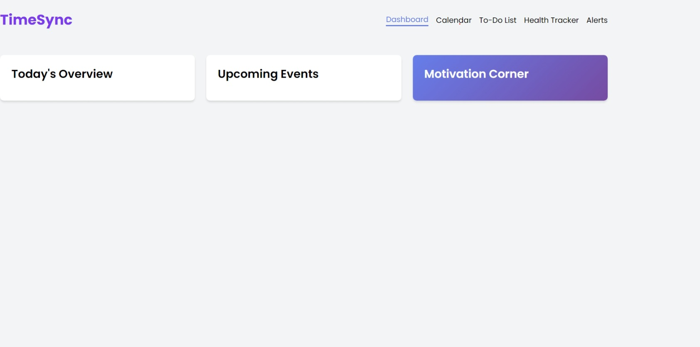
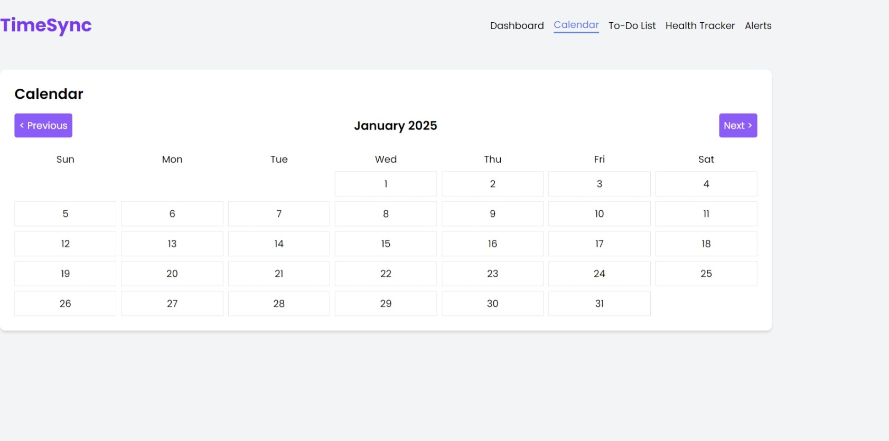
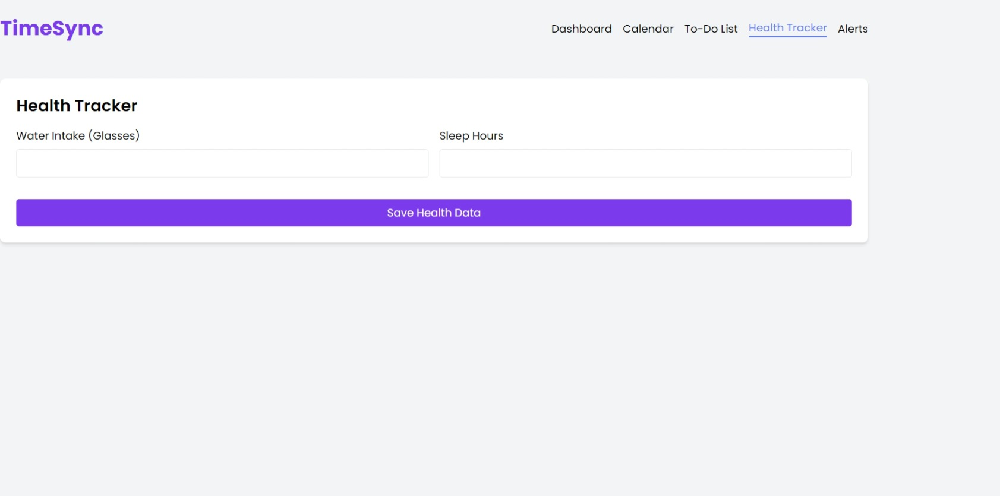

# time management 🎯

## Basic Details
### Team Name: [hackative]

### Team Members
- Member 1: [Anakha b] - [sngce College]
- Member 2: [Ann maria roy] - [sngce College]
- Member 3: [Akshaya biju] - [sngce College]

### Hosted Project Link
https://github.com/anakhaa269/timesync

### Project Description
[Time management web]

### The Problem statement
[meeting deadlines]

### The Solution
[organised web ]
## Technical Details
### Technologies/Components Used
For Software:
- [html]
- [Frameworks used]
- [Libraries used]
- [Tools used]

For Hardware:
- [List main components]
- [List specifications]
- [List tools required]

### Implementation
For Software:
# Installation
[commands]

# Run
[commands]

### Project Documentation
For Software:

# Screenshots (Add at least 3)

*Add caption explaining what this shows*

*Add caption explaining what this shows*

*Add caption explaining what this shows*

# Diagrams

*Add caption explaining your workflow*

For Hardware:

# Schematic & Circuit

*Add caption explaining connections*

*Add caption explaining the schematic*

# Build Photos

*List out all components shown*

*Explain the build steps*

*Explain the final build*

### Project Demo
# Video
[https://www.loom.com/share/6f3ed649b7b94f6f96ebaef82053c635?sid=f1f98784-8d09-4c6c-85f2-edef1891c967]
*Explain what the video demonstrates*

# Additional Demos
[Add any extra demo materials/links]

## Team Contributions
- [Name 1]: [Specific contributions]
- [Name 2]: [Specific contributions]
- [Name 3]: [Specific contributions]

---
Made with ❤️ at TinkerHub
